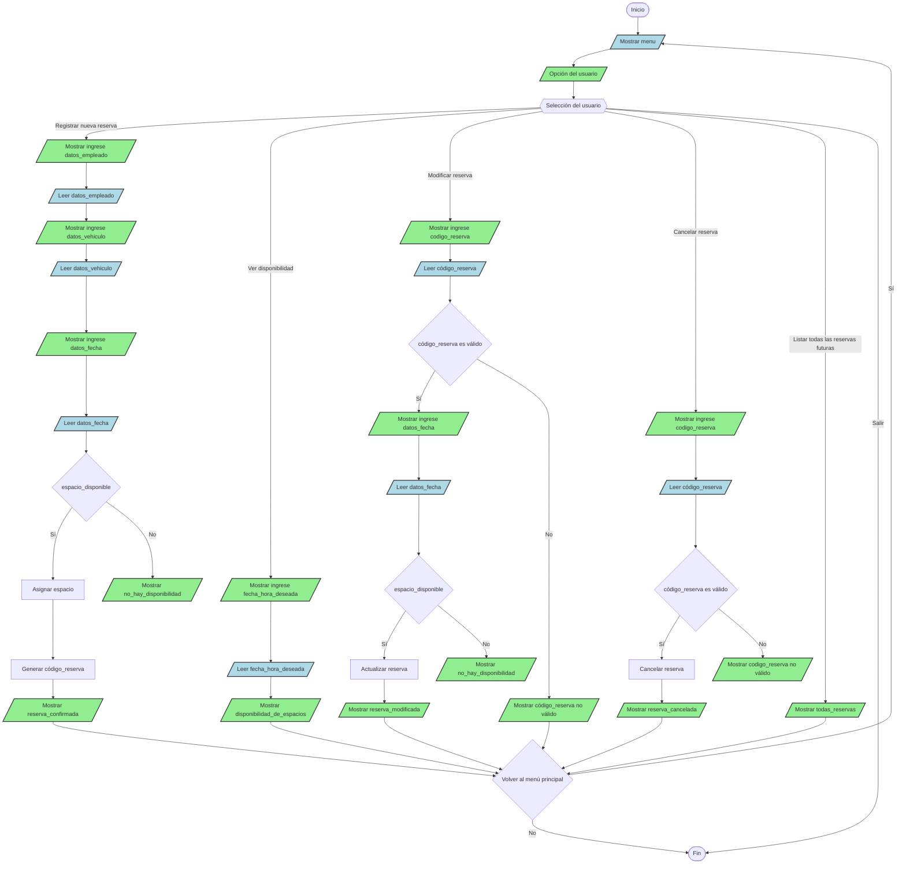

## Proceso: Gestión de reservas de estacionamiento

```mermaid
  graph TD;
    Menu[/Mostrar menu/]
    UserOption[/Opción del usuario/]
    UserSelection{{Selección del usuario}}
    Option1[/Mostrar ingrese datos_empleado/]
    Option2[/Mostrar ingrese fecha_hora_deseada/]
    Option3[/Mostrar ingrese codigo_reserva/]
    Option4[/Mostrar ingrese codigo_reserva/]
    ReservaList[/Mostrar todas_reservas/]
    FIN([ Fin ])

    INICIO([ Inicio ]) --> Menu:::Input;
    Menu --> UserOption:::Output;
    UserOption --> UserSelection;
    UserSelection -- Registrar nueva reserva --> Option1:::Output;
    UserSelection -- Ver disponibilidad --> Option2:::Output;
    UserSelection -- Modificar reserva --> Option3:::Output;
    UserSelection -- Cancelar reserva --> Option4:::Output;
    UserSelection -- Listar todas las reservas futuras --> ReservaList:::Output;
    UserSelection -- Salir --> FIN;

    Cond1b{Volver al menú principal} -- Sí --> Menu;
    Cond1b -- No --> FIN;

    
    Option1 --> Input1[/Leer datos_empleado/]:::Input;
    Input1 --> Option1b[/Mostrar ingrese datos_vehiculo/]:::Output;
    Option1b --> Input1b[/Leer datos_vehiculo/]:::Input;
    Input1b --> Option1c[/Mostrar ingrese datos_fecha/]:::Output;
    Option1c --> Input1c[/Leer datos_fecha/]:::Input;
    Input1c --> Cond1{espacio_disponible};
    Cond1 -- Sí --> Process1[Asignar espacio];
    Process1 --> Process2[Generar código_reserva];
    Process2 --> Output1f[/Mostrar reserva_confirmada/]:::Output;
    Output1f --> Cond1b;
    Cond1 -- No --> Output1e[/Mostrar no_hay_disponibilidad/]:::Output;

    Option2 --> Input2a[/Leer fecha_hora_deseada/]:::Input;
    Input2a --> Output2b[/Mostrar disponibilidad_de_espacios/]:::Output;
    Output2b --> Cond1b;

    Option3 --> Input3a[/Leer código_reserva/]:::Input;
    Input3a --> Cond3{código_reserva es válido};
    Cond3 -- Sí --> Output3b[/Mostrar ingrese datos_fecha/]:::Output;
    Output3b --> Input3b[/Leer datos_fecha/]:::Input;
    Input3b --> Cond3b{espacio_disponible};
    Cond3b -- Sí --> Process3[Actualizar reserva];
    Process3 --> Output3d[/Mostrar reserva_modificada/]:::Output;
    Cond3b -- No --> Output3e[/Mostrar no_hay_disponibilidad/]:::Output;
    Cond3 -- No --> Output3f[/Mostrar código_reserva no válido/]:::Output;
    Output3d --> Cond1b;
    Output3f --> Cond1b;

    Option4 --> Input4a[/Leer código_reserva/]:::Input;
    Input4a --> Cond4{código_reserva es válido};
    Cond4 -- Sí --> Process4[Cancelar reserva];
    Process4 --> Output4b[/Mostrar reserva_cancelada/]:::Output;
    Cond4 -- No --> Output4c[/Mostrar codigo_reserva no válido/]:::Output;
    Output4b --> Cond1b;

    ReservaList --> Cond1b;

  classDef Input fill:lightblue,stroke:#333,stroke-width:2px;
  classDef Output fill:lightgreen,stroke:#333,stroke-width:2px;
```
